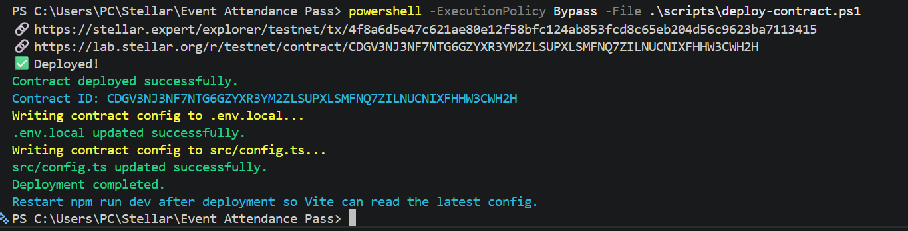
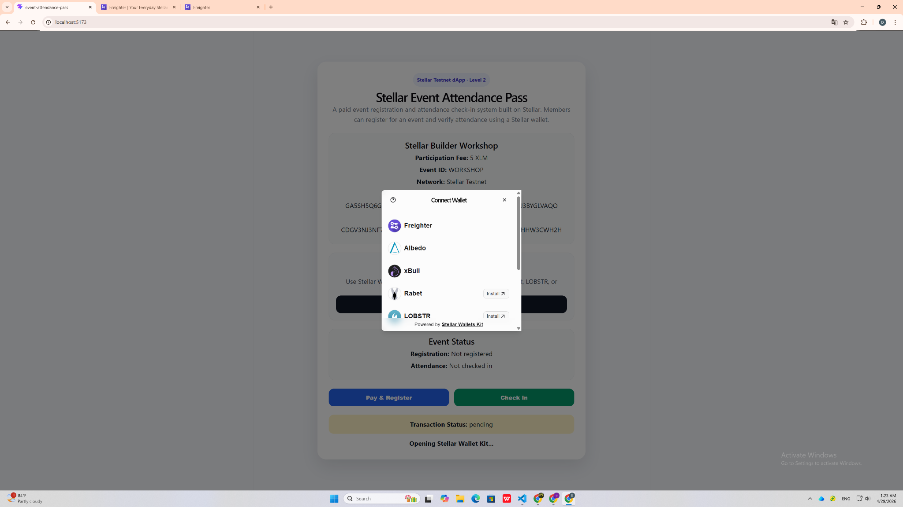
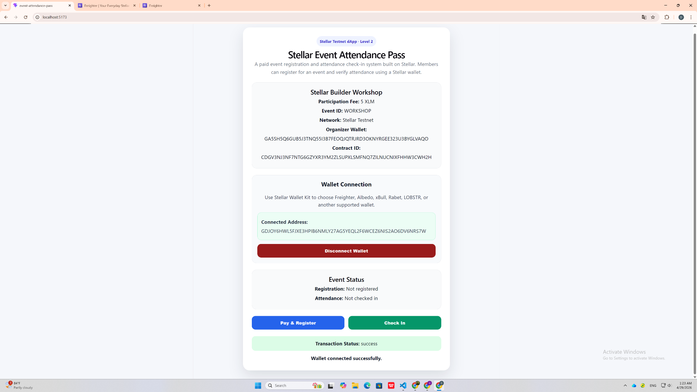
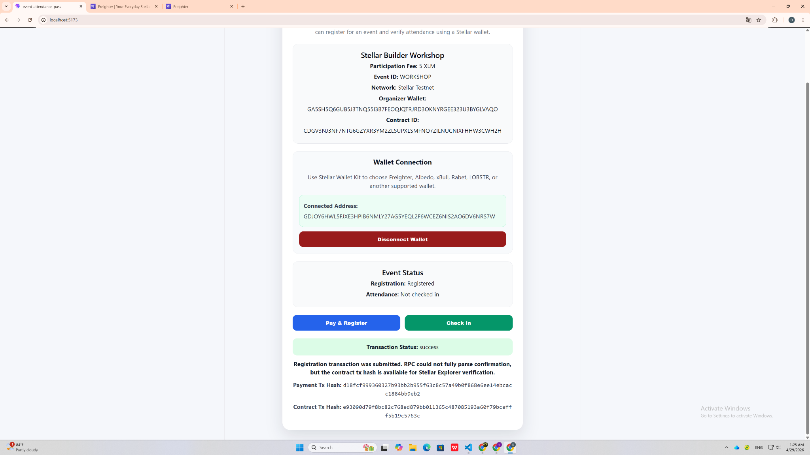
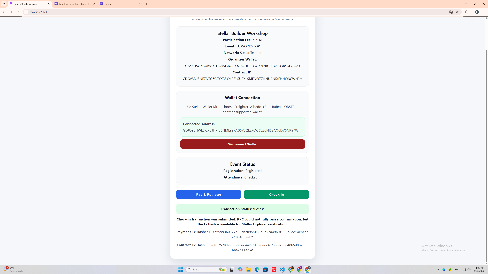

# Stellar Event Attendance Pass

Stellar Event Attendance Pass is a Level 2 Stellar dApp for paid event registration and attendance check-in.

The project allows members to connect a Stellar wallet, pay an event participation fee, register for an event, and check in through a deployed smart contract on Stellar Testnet.

---

## Project Overview

This project simulates a simple event registration system for workshops, meetups, or private events.

Flow:

1. User connects a Stellar wallet using Stellar Wallet Kit
2. User pays 5 XLM as the event participation fee
3. User registration is recorded through the smart contract
4. User checks in for the event through the smart contract
5. The app displays transaction status and transaction hashes

---

## Features

- Stellar Wallet Kit integration
- Multi-wallet selector
- Freighter wallet support
- Paid event registration with real XLM payment on Testnet
- Smart contract deployed on Stellar Testnet
- Frontend contract call for event registration
- Frontend contract call for event check-in
- Transaction status tracking: pending / success / fail
- Error handling for wallet connection, rejected transaction, insufficient balance, and failed contract call
- Contract ID automatically loaded from `src/config.ts`

---

## Tech Stack

- React
- TypeScript
- Vite
- Stellar SDK
- Stellar Wallet Kit
- Freighter Wallet
- Soroban Smart Contract
- Stellar Testnet

---

---

## Screenshots

All screenshot files are stored in the `screenshots` folder.

### 1. Contract Deployed

This image shows the smart contract deployment result on Stellar Testnet.

Image path: `screenshots/contract-deployed.png`



---

### 2. Wallet Options Available

This image shows the Stellar Wallet Kit modal with wallet options such as Freighter, Albedo, xBull, Rabet, and LOBSTR.

Image path: `screenshots/wallet-options.png`



---

### 3. Wallet Connected

This image shows the wallet connected successfully and the connected Stellar address displayed in the app.

Image path: `screenshots/wallet-connected.png`



---

### 4. Pay & Register Success

This image shows the user successfully paid the 5 XLM event fee and completed the smart contract registration call.

Image path: `screenshots/register-success.png`



---

### 5. Check-in Success

This image shows the user successfully checked in and the attendance status was recorded on-chain.

Image path: `screenshots/checkin-success.png`



---

## Event Details

```txt
Event Name: Stellar Builder Workshop
Participation Fee: 5 XLM
Event ID: WORKSHOP
Network: Stellar Testnet  